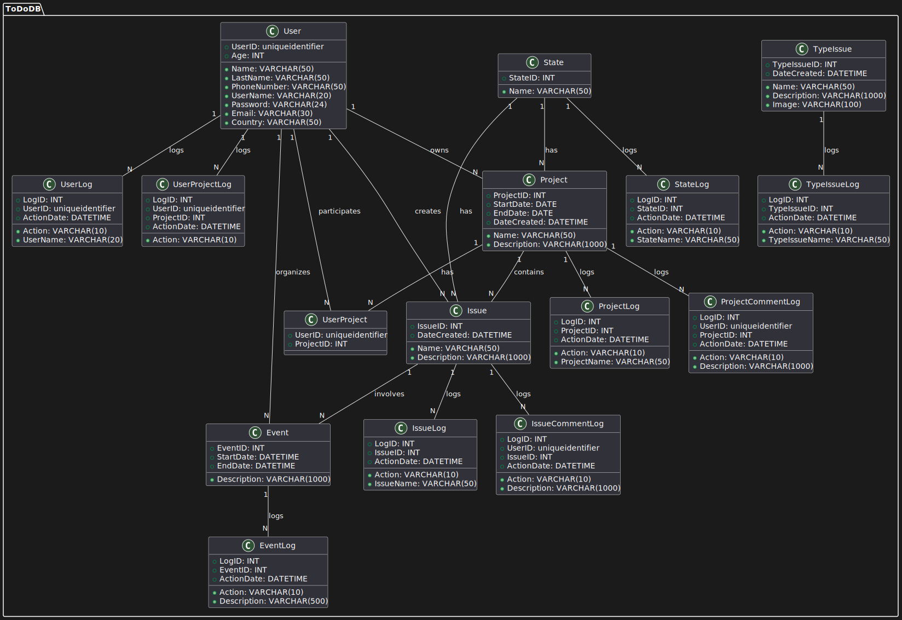
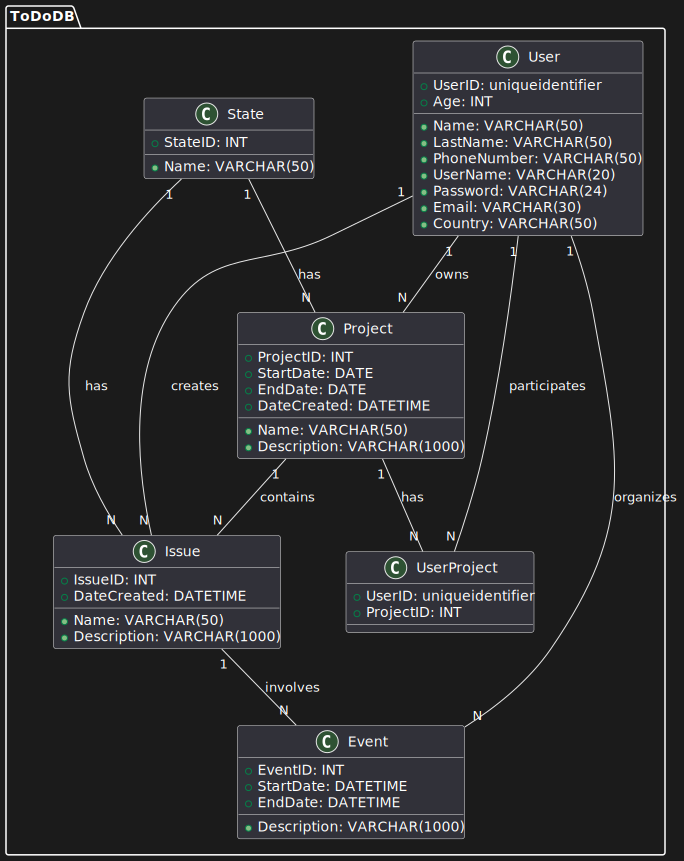

# ToDoDB (SQL Server)

**Author**: José Andrés Flores Barco  
**Email**: jafb537@gmail.com  
**LinkedIn**: [LinkedIn Profile](https://www.linkedin.com/in/jose-flores-barco)  

## Project Description
ToDoDB is a SQL Server database designed for task management. It allows for the administration of users, projects, tasks, and associated events. This database provides essential functionalities to efficiently organize and manage daily activities and complex projects.

## Projects Using This Database
- **ToDo Task Management Project**
  - Description: Web application for task management in corporate and personal environments.
  - Technologies: JavaScript, Node.js, Express.js, SQL Server.
  - [GitHub Repository](https://github.com/JAFB537/ToDo-ApiRest/tree/DBConnection)

## Entity-Relationship Model for ToDoDB

Here is the entity-relationship diagram showing the relationships of the main tables in the ToDoDB database:

### Entities and Relationships

#### User
- Attributes:
  - `UserID` (PK)
  - `Name`
  - `LastName`
  - `Age`
  - `PhoneNumber`
  - `UserName`
  - `Password`
  - `Email`
  - `Image`
  - `Country`
- Relationships:
  - Has many Projects through `UserProject`
  - Can create `ProjectComment`
  - Can create `Issue`
  - Can create `IssueComment`
  - Can create `Event`
  - Can create `UserLog`

#### State
- Attributes:
  - `StateID` (PK)
  - `Name`
- Relationships:
  - Belongs to many `Project`

#### Project
- Attributes:
  - `ProjectID` (PK)
  - `Name`
  - `Description`
  - `StartDate`
  - `EndDate`
  - `DateCreated`
  - `StateID` (FK)
  - `UserID` (FK)
- Relationships:
  - Belongs to `State`
  - Has many `User` through `UserProject`
  - Can create `ProjectComment`
  - Can create `Issue`
  - Can create `ProjectLog`

#### UserProject
- Attributes:
  - `UserID` (FK, PK)
  - `ProjectID` (FK, PK)
- Relationships:
  - Belongs to `User`
  - Belongs to `Project`
  - Can create `UserProjectLog`

#### ProjectComment
- Attributes:
  - `UserID` (FK, PK)
  - `ProjectID` (FK, PK)
  - `Description`
- Relationships:
  - Belongs to `User`
  - Belongs to `Project`
  - Can create `ProjectCommentLog`

#### TypeIssue
- Attributes:
  - `TypeIssueID` (PK)
  - `Name`
  - `Description`
  - `Image`
  - `DateCreated`
- Relationships:
  - Can create `Issue`
  - Can create `TypeIssueLog`

#### Issue
- Attributes:
  - `IssueID` (PK)
  - `Name`
  - `Description`
  - `DateCreated`
  - `StateID` (FK)
  - `TypeIssueID` (FK)
  - `UserID` (FK)
  - `ProjectID` (FK)
- Relationships:
  - Belongs to `State`
  - Belongs to `TypeIssue`
  - Belongs to `User`
  - Belongs to `Project`
  - Can create `IssueComment`
  - Can create `IssueLog`

#### IssueComment
- Attributes:
  - `UserID` (FK, PK)
  - `IssueID` (FK, PK)
  - `Description`
- Relationships:
  - Belongs to `User`
  - Belongs to `Issue`
  - Can create `IssueCommentLog`

#### Event
- Attributes:
  - `EventID` (PK)
  - `StartDate`
  - `EndDate`
  - `Description`
  - `UserID` (FK)
  - `IssueID` (FK)
- Relationships:
  - Belongs to `User`
  - Belongs to `Issue`
  - Can create `EventLog`

## Logs

### UserLog
- Attributes:
  - `LogID` (PK)
  - `Action`
  - `UserID` (FK)
  - `UserName`
  - `ActionDate`

### StateLog
- Attributes:
  - `LogID` (PK)
  - `Action`
  - `StateID` (FK)
  - `StateName`
  - `ActionDate`

### ProjectLog
- Attributes:
  - `LogID` (PK)
  - `Action`
  - `ProjectID` (FK)
  - `ProjectName`
  - `ActionDate`

### UserProjectLog
- Attributes:
  - `LogID` (PK)
  - `Action`
  - `UserID` (FK)
  - `ProjectID` (FK)
  - `ActionDate`

### ProjectCommentLog
- Attributes:
  - `LogID` (PK)
  - `Action`
  - `UserID` (FK)
  - `ProjectID` (FK)
  - `Description`
  - `ActionDate`

### TypeIssueLog
- Attributes:
  - `LogID` (PK)
  - `Action`
  - `TypeIssueID` (FK)
  - `TypeIssueName`
  - `ActionDate`

### IssueLog
- Attributes:
  - `LogID` (PK)
  - `Action`
  - `IssueID` (FK)
  - `IssueName`
  - `ActionDate`

### IssueCommentLog
- Attributes:
  - `LogID` (PK)
  - `Action`
  - `UserID` (FK)
  - `IssueID` (FK)
  - `Description`
  - `ActionDate`

### EventLog
- Attributes:
  - `LogID` (PK)
  - `Action`
  - `EventID` (FK)
  - `Description`
  - `ActionDate`

## Additional Sections
- **Data Model**: Found in the `ToDoDB_DataModel.pdf` file.
- **Configuration**: Detailed instructions for setting up the database are in the `CONFIGURATION.md` file.

For contributions to the project, please refer to the guidelines in `CONTRIBUTING.md`.

Thank you for your interest in ToDoDB (SQL Server)! 🚀

## Requirements
- SQL Server
- SQL Server Management Studio (SSMS) or similar tool to execute SQL scripts.

## Installation
1. **Clone the repository:** https://github.com/JAFB537/ToDoDB.git

